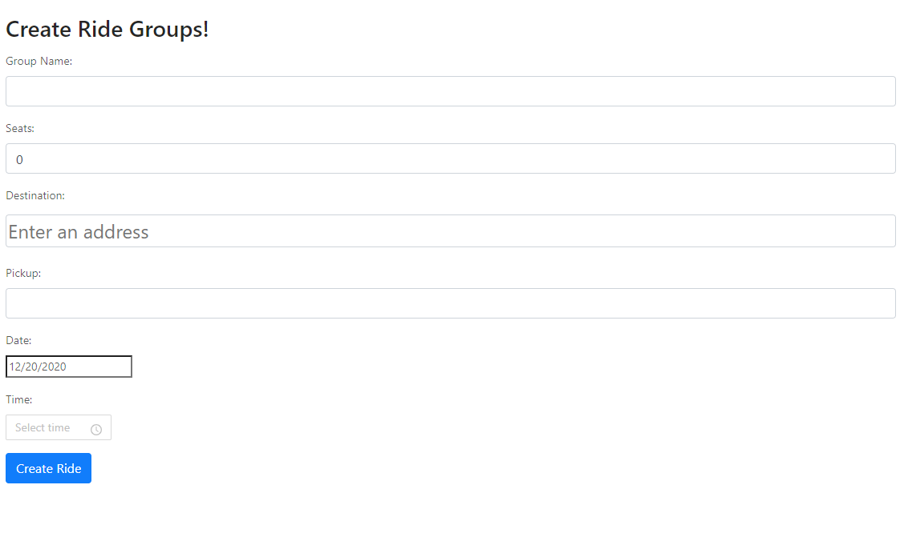

# RideBuddies

[Live Demo](https://ride-buddies.herokuapp.com/)

# Features

---

-  Stack used: React.js, Node.js,Express,MongoDB
-  User can host a ride by providing information like Group Name, Seats, Destination, Pick location, Date and time.
-  Google Map API to display Ride destinations and to better help user search for rides
-  User Authorization and using Passport-JWT
-  Rides Index page where users can view and join all available rides
-  Ride Information card to view all information of a ride

---

## Landing Page

On the Landing Page, Users are freeted with a welcome message and are given some options to look for rides and view rides the are in.
I have implemented a Navbar that allows users to navigate to different pages using Links from react-routers.


## Google Maps API

Using Google Map API, I was able to display all the rides so that users could visually the ride destinations. For each marker there is a pop up window to show information of the ride. I also use Google Map's geocoding fuction to create a search bar so that Users could search for where they want to go and find if there is a ride available.


As the user is typing in the search bar, the search bar will provide suggestion to possible addresses. Once the user have entered an address, Google Map's geolocation function will turn the address into latitude and longitude.

```
const PlacesAutocomplete  = props =>{
    const{
        ready,
        value,
        suggestions:{status,data},
        setValue,
        clearSuggestions,
    } = usePlacesAutocomplete({
        requestOptions:{
            location:{ lat:()=>37.774929,lng:()=>-122.419418},
            radius:200*1000,
        },
    });
    return (
        <div className='search'>
            <Combobox onSelect={ async (address)=>{
                setValue(address,false);
                clearSuggestions();

                try{
                    const results = await getGeocode({address});
                    const {lat, lng} = await getLatLng(results[0]);
                    props.panTo({lat,lng});
                }catch(err){
                    console.log(err);
                }

                }}>
                <ComboboxInput
                    value={value}
                    onChange={(e)=>{setValue(e.target.value);}}
                    disabled={!ready}
                    placeholder="Enter an address"
                    />
                    <ComboboxPopover>
                        <ComboboxList>
                        {status==="OK" && data.map(({id,description})=>(
                            <ComboboxOption key={id} value={description}/>
                        ))}
                       </ComboboxList>
                    </ComboboxPopover>
            </Combobox>
        </div>

    )
}
```

After getting the latitude and longitude, the panTo function will get called and zoom to that location.

```
  panTo({lat,lng}){
        this.state.map.panTo({lat,lng});
        this.state.map.setZoom(15);
        this.setState({currlat:lat,currlong:lng});
   }
```

## Creating Rides

One of the problem I ran into is how to convert the Ride entries into location markers on the map. My original idea is to use Google Maps geocoding funciton to translate the ride location into latitude and longitude and map the rides. However, I found the more intuitive way is to store the latitude and longitude when creating a ride. So I refactor the search bar on the Map page so that when the user enter an address, it will automatically store the latitude and longitude into the database.



# Additional Information

[Database Schema](https://github.com/rjzhao1/RideBuddiesDeploy/wiki/Schema)
